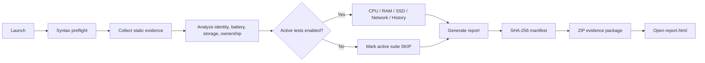

<div align="center">

# MacBook Verify

### One-click MacBook verification, diagnostics, and evidence collection

**Inspect a used MacBook with repeatable software checks, active self-tests, deep battery analysis, and guided physical verification — entirely on-device.**


[Quick Start](#quick-start) · [What It Checks](#what-it-checks) · [Test Modes](#test-modes) · [Report](#report-and-evidence) · [Limitations](#important-limitations)

</div>

---

## Overview

**MacBook Verify** is an offline macOS inspection and self-test toolkit designed for evaluating a MacBook before **buying, selling, accepting a repair, or troubleshooting suspicious hardware behavior**.

Instead of relying on a single “health percentage,” the tool builds a structured evidence set from multiple independent sources:

- static hardware and ownership information;
- cross-source identity consistency checks;
- deep battery-controller telemetry;
- active CPU, memory, storage, and network tests;
- recent panic and power-history evidence;
- guided display, keyboard, trackpad, camera, microphone, speaker, port, chassis, and serial checks;
- a portable HTML report with raw evidence and integrity hashes.

> [!IMPORTANT]
> MacBook Verify intentionally does **not** claim that software can prove a Mac is “100% original.” A healthy machine can still have undergone a legitimate Apple repair, component-level board repair, chassis replacement, or other work that software cannot reliably detect.

## Demo

<p align="center">
  
</p>

## Why MacBook Verify?

Checking a used Mac manually usually means opening several System Settings pages, running ad-hoc Terminal commands, testing hardware by memory, and trying to decide whether individual values are meaningful.

MacBook Verify turns that process into a **repeatable inspection workflow**:

```text
Collect evidence
      ↓
Cross-check identity
      ↓
Analyze battery / storage / ownership / security
      ↓
Run controlled active self-tests
      ↓
Guide physical and interactive checks
      ↓
Generate report + raw evidence + SHA-256 manifest + ZIP
```

The design principle is simple: **automate what software can verify, preserve evidence for what needs review, and never manufacture certainty where none exists.**

---

## Quick Start

### Option 1 — One-click run

Clone or download the repository, then double-click:

```text
MacBookVerify.command
```

The default profile is **Full Check**. When complete, MacBook Verify automatically opens the generated `report.html` and creates a ZIP package on the Desktop.

From Terminal:

```bash
git clone https://github.com/NgocThanhLuong/macbook-verify.git
cd macbook-verify
./MacBookVerify.command --full
```

### Option 2 — Install as a macOS app

Double-click:

```text
Install.command
```

The installer creates:

```text
~/Applications/MacBook Verify.app
```

You can then launch **MacBook Verify** like a normal macOS application.

> [!NOTE]
> macOS may warn when opening locally downloaded scripts or an ad-hoc signed app. Review the source before running it. The project intentionally uses standard macOS tools and does not require a remote installer.

---

## What It Checks

### 1. Identity and configuration

MacBook Verify gathers and compares hardware identity from independent macOS sources.

| Check | Purpose |
| --- | --- |
| Model name / identifier / number | Confirm detected Mac family and configuration |
| Chip / CPU / GPU / memory | Verify the active hardware configuration |
| `system_profiler` serial vs IOKit serial | Detect unexpected identity inconsistency |
| `system_profiler` model vs `sysctl hw.model` | Cross-check model identity |
| Local model reference | Validate known display/model expectations where available |
| Bottom-case serial | Guided physical comparison with system serial |

A mismatch is treated as evidence requiring investigation, **not automatically as proof of fraud or repair**.

### 2. Battery deep analysis

The battery analyzer goes beyond cycle count and the macOS “Normal” status.

It evaluates data exposed by `system_profiler` and `AppleSmartBattery`, including:

- condition and cycle count;
- maximum capacity;
- design capacity and raw maximum capacity;
- `PermanentFailureStatus`;
- `BatteryCellDisconnectCount`;
- individual cell-voltage spread;
- Qmax spread between cells;
- controller design-cycle reference when exposed;
- lifetime maximum-temperature telemetry when exposed;
- post-load battery snapshot and cell balance.

Battery-controller fields are interpreted conservatively. For example, a non-zero disconnect counter is **not** automatically classified as proof that a battery was replaced.

### 3. Display and graphics

Automatic checks include:

- built-in display detection;
- reported display type;
- native resolution;
- internal connection state;
- online state;
- model-reference resolution comparison when known.

The interactive report adds fullscreen:

- white;
- black;
- gray;
- red;
- green;
- blue;

These screens help inspect dead pixels, bright pixels, discoloration, lines, uneven backlighting, and other visible defects.

### 4. SSD and storage

Static checks include:

- internal SSD model and capacity;
- SMART status;
- TRIM status;
- detachable/internal characteristics.

The active storage test additionally:

1. creates a temporary file under `/private/tmp`;
2. writes the selected test size;
3. calculates SHA-256;
4. reads the data again through a separate path;
5. calculates SHA-256 again;
6. verifies data integrity;
7. records coarse read/write throughput;
8. removes the temporary file.

Throughput is reported as **INFO**, not used as a universal pass/fail benchmark because cache state, thermals, SSD capacity, model, free space, and filesystem behavior materially affect speed measurements.

### 5. CPU and stability

The active CPU test:

- starts multiple logical-core workers;
- maintains sustained CPU load for the selected profile;
- repeatedly hashes deterministic data during the load;
- checks for integrity mismatches;
- samples `pmset -g therm` for obvious power/thermal pressure indications.

This is a controlled stability test, not a synthetic benchmark competition.

### 6. Memory integrity

When Apple Command Line Tools are available, MacBook Verify compiles the bundled native C helper locally and performs pattern write/read verification over the selected memory amount.

If a compiler is unavailable, the test is explicitly reported as **SKIP**. The tool never converts “unable to test” into a false PASS.

### 7. Ownership and security

Used Macs should be checked for ownership-management risks as well as hardware health.

MacBook Verify inspects:

- MDM enrollment;
- Automated Device Enrollment / DEP state when exposed;
- Activation Lock state when exposed;
- System Integrity Protection (SIP);
- FileVault status;
- Gatekeeper state as supporting information.

> [!WARNING]
> A Mac intended for resale should not remain tied to the seller’s Activation Lock or organization management. Always complete the appropriate sign-out, erase, and activation checks before money changes hands.

### 8. Repair and service evidence

The tool looks for Parts & Service / repair-related `system_profiler` data types when the current macOS build exposes them.

It deliberately does **not** treat normal framework or process names such as `CoreRepairKit`, `mobilerepaird`, or `corerepaird` as evidence that a repair occurred.

When available, also review:

```text
System Settings → General → About → Parts & Service
```

### 9. Devices and connectivity

The report preserves inventory and/or guided checks for:

- camera;
- microphone;
- speakers;
- Wi-Fi;
- Bluetooth;
- USB;
- Thunderbolt / USB-C;
- MagSafe;
- HDMI;
- SD card reader;
- headphone output.

A physical port cannot be proven functional while empty. Port tests therefore require a known-good device or cable.

### 10. Error and stability history

MacBook Verify scans standard diagnostic locations and power history for evidence such as:

- recent panic reports;
- kernel-related diagnostic reports;
- GPU-reset report filenames;
- shutdown / sleep / wake warning lines;
- selected power-management warnings.

These are retained as evidence for review because a matching log line does not always indicate a hardware defect.

---

## Test Modes

```bash
./MacBookVerify.command --quick
./MacBookVerify.command --full
./MacBookVerify.command --deep
./MacBookVerify.command --burn-in
./MacBookVerify.command --static-only
```

| Mode | Typical use | CPU load | RAM test | SSD scratch | History |
| --- | --- | ---: | ---: | ---: | ---: |
| **Quick** | Fast initial inspection | 8 s | 64 MiB | 128 MiB | 7 days |
| **Full** | Recommended used-Mac inspection | 20 s | 256 MiB | 512 MiB | 14 days |
| **Deep** | Expensive or suspicious machine | 45 s | 512 MiB | 1 GiB | 30 days |
| **Burn-in** | Post-repair stability verification | 180 s | 1 GiB | 1 GiB | 30 days |
| **Static-only** | Inventory with no active workload/write test | — | — | — | static evidence only |

Temporary storage test data is written under `/private/tmp`, not Desktop/iCloud, and is removed after the test.

### Recommended workflow for a used Mac

For most purchase inspections:

```bash
./MacBookVerify.command --full
```

Then complete the **Interactive Verification** section in `report.html` and, for a high-value purchase, run Apple Diagnostics separately.

---

## Interactive Verification Wizard

The generated HTML report includes a browser-based local test wizard for checks that require human confirmation.

### Physical inspection

- bottom-case serial comparison;
- screw/tool marks;
- chassis gaps and pry marks;
- hinge behavior;
- corrosion / liquid-damage indicators visible externally;
- Touch ID confirmation.

### Input devices

- keyboard event map;
- trackpad movement;
- left click;
- right click;
- scrolling.

### Audio / video

- left speaker tone;
- right speaker tone;
- stereo playback;
- camera preview;
- microphone input-level meter.

Camera and microphone tests require browser permission.

### Ports

The wizard guides the operator through connecting known-good devices to the available ports and recording PASS / WARN / FAIL / SKIP results.

Interactive answers are stored locally in browser `localStorage` and can be exported as:

```text
interactive-results.json
```

MacBook Verify does not upload these results.

---

## Report and Evidence

A normal run generates:

```text
~/Desktop/MacBook-Verify-YYYYMMDD-HHMMSS/
├── report.html
├── summary.txt
├── summary.json
├── results.tsv
├── manifest.sha256
└── raw/
    ├── hardware.txt
    ├── platform-ioreg.txt
    ├── battery-system.txt
    ├── battery-raw.txt
    ├── battery-postload.txt
    ├── display.txt
    ├── storage.txt
    ├── memory.txt
    ├── cpu-thermal.txt
    ├── memory-active.txt          # when native test is available
    ├── mdm.txt
    ├── repair-history.txt
    ├── recent-diagnostics.txt
    ├── power-history.txt
    ├── camera.txt
    ├── audio.txt
    ├── wifi.txt
    ├── bluetooth.txt
    ├── usb.txt
    ├── thunderbolt.txt
    └── ...

~/Desktop/MacBook-Verify-YYYYMMDD-HHMMSS.zip
```

### Evidence integrity

`manifest.sha256` contains hashes for the generated evidence files so a collected report can later be checked for accidental modification.

---

## Understanding Results

| Status | Meaning |
| --- | --- |
| **PASS** | The specific test completed and met its rule |
| **WARN** | Evidence deserves review or a repeat test |
| **FAIL** | A concrete inconsistency or high-risk condition was detected |
| **INFO** | Useful evidence that should not be interpreted as pass/fail |
| **SKIP** | The test could not be performed in the current environment |

The dashboard also calculates an **automatic health score** from scored checks.

That number is a **test-health indicator**, not:

- an originality percentage;
- a resale-price score;
- proof the Mac has never been repaired;
- a substitute for Apple Diagnostics or physical inspection.

---

## Project Architecture

```text
macbook-verify/
├── MacBookVerify.command          # one-click launcher
├── Install.command                # installs the local .app wrapper
├── data/
│   └── models.tsv                 # local model-reference data
├── helpers/
│   └── memory_test.c              # native RAM pattern verifier
├── scripts/
│   ├── verify.sh                  # orchestration / CLI entry point
│   ├── collectors/
│   │   └── static.sh              # evidence collection + static analysis
│   ├── tests/
│   │   └── active.sh              # CPU/RAM/SSD/network/history tests
│   ├── lib/
│   │   └── common.sh              # parsing, scoring, result helpers
│   └── report.sh                  # HTML/JSON/text report generation
├── docs/
│   └── CHECKS.md                  # detailed check reference
├── LICENSE
└── README.md
```

### Runtime flow



---

## CLI Reference

```text
MacBook Verify v1.0.0

Usage:
  verify.sh [--quick|--full|--deep|--burn-in]
            [--static-only]
            [--no-open]
            [--output DIR]
```

Examples:

```bash
# Recommended inspection
./MacBookVerify.command --full

# Fast initial check
./MacBookVerify.command --quick

# More extensive inspection
./MacBookVerify.command --deep

# Stability check after repair
./MacBookVerify.command --burn-in

# No active CPU/RAM/SSD workload
./MacBookVerify.command --static-only

# Save reports somewhere other than Desktop
./MacBookVerify.command --full --output "$HOME/Documents"

# Do not open the HTML report automatically
./MacBookVerify.command --full --no-open
```

---

## Requirements

### Required

- macOS 11 or newer;
- Apple system `/bin/bash` compatible environment;
- standard macOS command-line utilities used by the project.

### Optional

- Apple Command Line Tools / compiler for the native RAM pattern test.

### Not required

- Homebrew;
- Python;
- Node.js;
- Docker;
- server infrastructure;
- cloud account;
- external API key.

---

## Privacy and Security Model

MacBook Verify is designed to run **locally**.

It does not require a backend and does not intentionally upload inspection data. Reports can contain sensitive device identifiers, including serial numbers and hardware metadata.

Before sharing a report publicly:

1. review `summary.json`, `summary.txt`, and files under `raw/`;
2. redact serial numbers and identifiers you do not want to expose;
3. share only the evidence needed for the review.

The project performs controlled temporary disk writes and CPU workload tests. Scratch data is removed at the end of a successful run and cleanup is also registered through the script exit trap.

---

## Important Limitations

No software-only tool can reliably prove that a Mac has never been repaired or modified.

Even a perfect MacBook Verify report cannot conclusively determine whether:

- the bottom case has ever been opened;
- an IC or component on the logic board has been repaired;
- a genuine Apple assembly was replaced with another genuine Apple assembly;
- liquid damage was repaired or cleaned in the past;
- a physically empty port works without known-good test hardware;
- every intermittent hardware problem will reproduce during a short test window.

For a high-value purchase, combine MacBook Verify with:

- physical inspection;
- bottom-case serial comparison;
- macOS Parts & Service information when available;
- seller sign-out / Activation Lock verification;
- erase-and-activation verification when appropriate;
- Apple Diagnostics;
- known-good charger, cable, display, SD card, USB-C/Thunderbolt device, and headphones for port testing.

---

## Safety Philosophy

MacBook Verify favors **conservative conclusions**:

- missing evidence becomes `INFO` or `SKIP`, not PASS;
- ambiguous telemetry becomes `WARN` or supporting information;
- model-specific performance assumptions are avoided where they would create false failures;
- raw source data is preserved so an operator can independently review the decision.

The goal is not to make the purchasing decision for the user. The goal is to make the machine’s observable condition easier to inspect and document.

---

## Development

The project intentionally keeps runtime dependencies minimal and uses macOS-native tooling.

Before running test modules, the launcher performs a Bash syntax preflight so a damaged or partially copied package fails early instead of beginning an active hardware test.

When extending a check:

1. preserve the original evidence under `raw/` whenever practical;
2. distinguish `PASS`, `WARN`, `FAIL`, `INFO`, and `SKIP` carefully;
3. avoid interpreting a single ambiguous telemetry field as proof of repair;
4. avoid universal performance thresholds unless model-specific evidence supports them;
5. keep active tests bounded and clean up temporary data.

Detailed check behavior is documented in [`docs/CHECKS.md`](docs/CHECKS.md).

---

## Roadmap

Potential future improvements include:

- broader Mac model-reference coverage;
- richer battery trend sampling across multiple load states;
- optional signed/notarized app distribution;
- more automated port-device detection;
- structured Apple Diagnostics result import;
- report comparison between multiple inspections of the same machine;
- additional regression fixtures for parser validation across macOS versions.

---

## Disclaimer

MacBook Verify is an independent diagnostic utility and is **not affiliated with, endorsed by, or supported by Apple Inc.**

Apple, Mac, MacBook, macOS, and related product names are trademarks of Apple Inc.

Use the tool at your own discretion. Inspection results should be treated as technical evidence, not as a warranty, certification of originality, or guarantee of future hardware reliability.

---

## License

Released under the [MIT License](LICENSE).

<div align="center">

**MacBook Verify** — evidence first, conclusions second.

</div>
